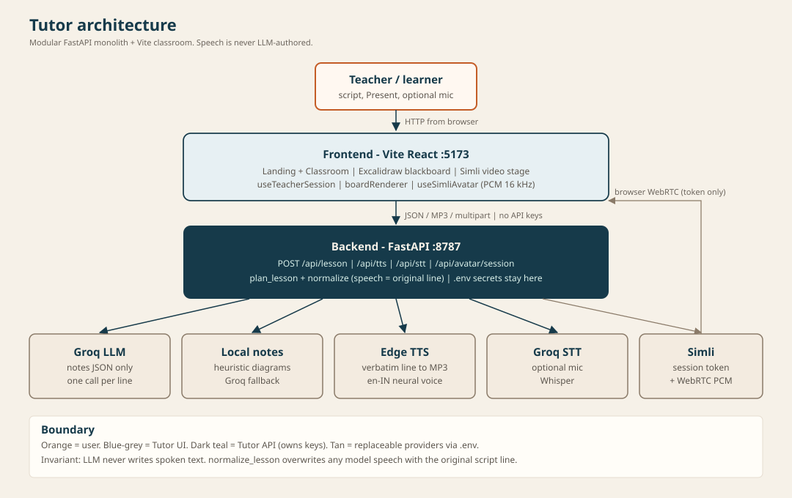
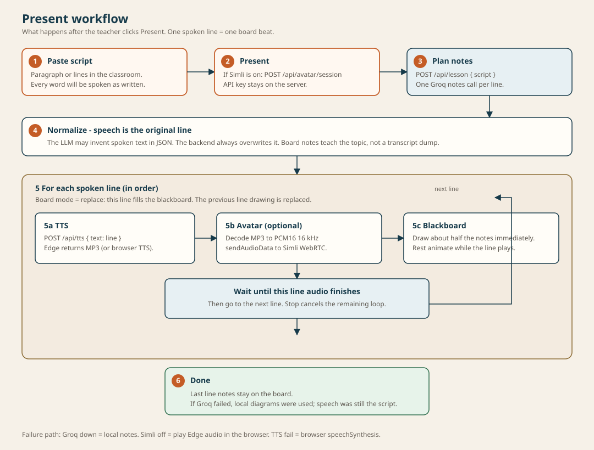

# Architecture (arc42-lite)

Tutor is a **modular FastAPI monolith** plus a **Vite React classroom**. This page is the map; details live in [diagrams/](diagrams/) and [adr/](adr/).

## 1. Goals

- Speak a teacher-authored script **verbatim**
- Draw **presentable notes and diagrams** for each line
- Lip-sync a Simli face to that same audio
- Keep providers swappable from `.env`

## 2. Constraints

- No LLM-authored speech
- Secrets must not ship to the browser
- Classroom demo must run on one machine (Python + Node)
- Avatar is optional; teaching must work without it

## 3. Context

See [diagrams/architecture.svg](diagrams/architecture.svg) and [diagrams/system-context.md](diagrams/system-context.md). External actors: teacher/student browser, Groq, Microsoft Edge TTS, Simli.

## 4. Solution strategy

1. Split the script into lines; each line is one lesson segment.
2. Ask the LLM **only** for blackboard JSON (notes + diagram elements).
3. Overwrite any `speech` field with the original line before returning.
4. Frontend plays Edge TTS (or sends PCM into Simli) and incrementally draws Excalidraw elements.

## 5. Building blocks

See [diagrams/container.md](diagrams/container.md) and [diagrams/component.md](diagrams/component.md).

- `backend/app/main.py` — HTTP API, CORS, rate limit
- `services/lesson.py` — plan + normalize (verbatim speech)
- `providers/*` — Groq / Edge / local adapters behind protocols
- `frontend` — script panel, Excalidraw board, Simli stage

## 6. Runtime

See [diagrams/present-sequence.md](diagrams/present-sequence.md) and [diagrams/workflow.svg](diagrams/workflow.svg).

## 7. Deployment

See [diagrams/deployment.md](diagrams/deployment.md) and [deployment.md](deployment.md). Dev: Uvicorn `:8787` + Vite `:5173`.

## 8. Cross-cutting

- Config: `backend/app/core/settings.py` + root `.env`
- Errors: JSON `{ "error": "..." }`
- Rate limit: in-memory per IP for mutating routes (`/health`, public config, and OPTIONS excluded; not multi-instance safe)
- CORS: `CORS_ORIGIN`

## 9. Decisions

ADRs in [adr/](adr/).

## 10. Quality & risks

| Risk | Mitigation |
|---|---|
| Groq down / bad URL | Local diagram fallback |
| Simli minutes depleted | Avatar off; TTS still plays |
| LLM copies the script onto the board | Prompt + label clipping + verbatim speech overwrite |
| Secrets in git | `.gitignore` `.env`; `.env.example` only |

## 11. Glossary

| Term | Meaning |
|---|---|
| Script | Spoken lines the tutor must speak unchanged (capped by `MAX_SCRIPT_LINES`) |
| Segment / beat | One script line + its board elements |
| Local LLM | Heuristic diagram builder, not a hosted model |
| Avatar ready | `AVATAR_ENABLED`, module `simli`, key, and face id all set |
