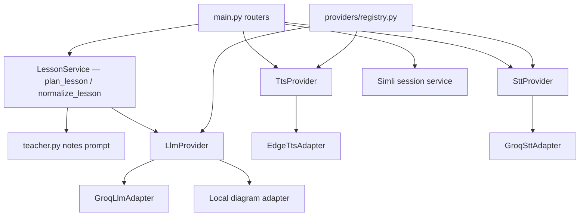

# Component view

Backend dependency flow:

Frontend: `useTeacherSession` orchestrates lesson + TTS + board draw; `useSimliAvatar` sends PCM; `boardRenderer` converts elements to Excalidraw.

Routers do not call Groq/Simli SDKs directly except through adapters/services.
