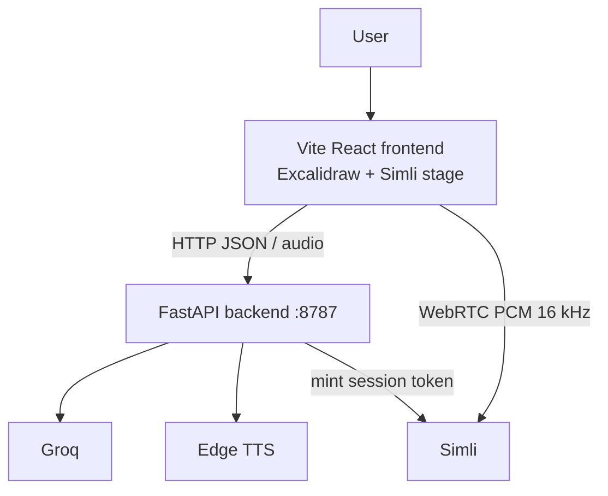

# Container view

Inside Tutor:

```mermaid
flowchart TB
  user[User]
  web[Vite React frontend<br/>Excalidraw + Simli stage]
  api[FastAPI backend :8787]
  groq[Groq]
  edge[Edge TTS]
  simli[Simli]

  user --> web
  web -->|HTTP JSON / audio| api
  api --> groq
  api --> edge
  api -->|mint session token| simli
  web -->|WebRTC PCM 16 kHz| simli
```

There is no database container. Config is `.env` on the API host. The frontend public config is a subset of settings with secrets stripped.
