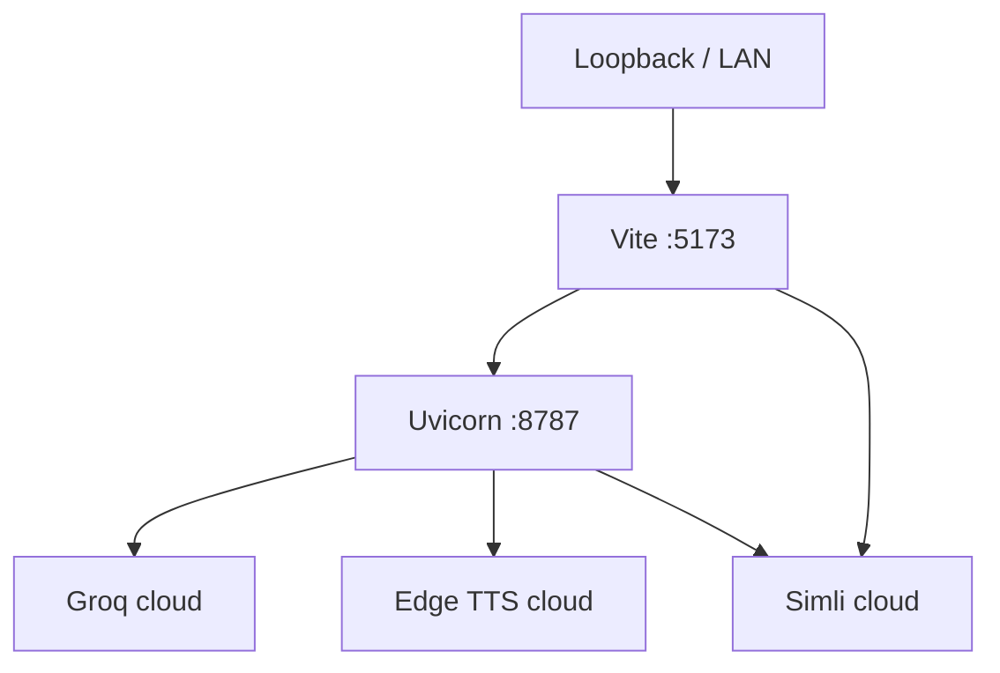

# Deployment view

Current (development):

No load balancer, database, or object store. Secrets: process environment / `.env` on the API host. Health check: `GET /health`. Rollback: previous git revision + restart processes. See [../deployment.md](../deployment.md).
