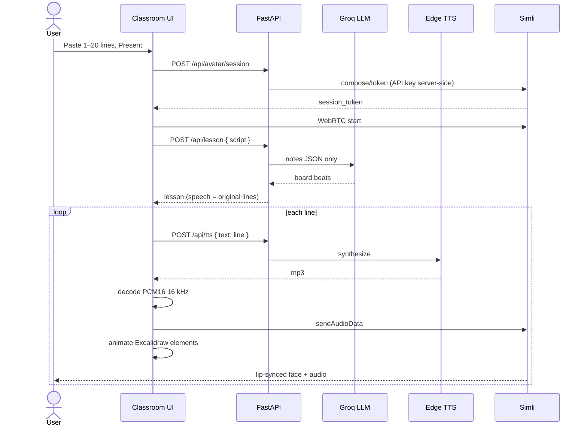

# Present sequence

Happy path for one Present click:

If Groq is down, `plan_lesson` uses local diagrams; speech is still the script. If Simli is off, the UI plays Edge audio directly.

Rendered diagram: [workflow.svg](workflow.svg).
