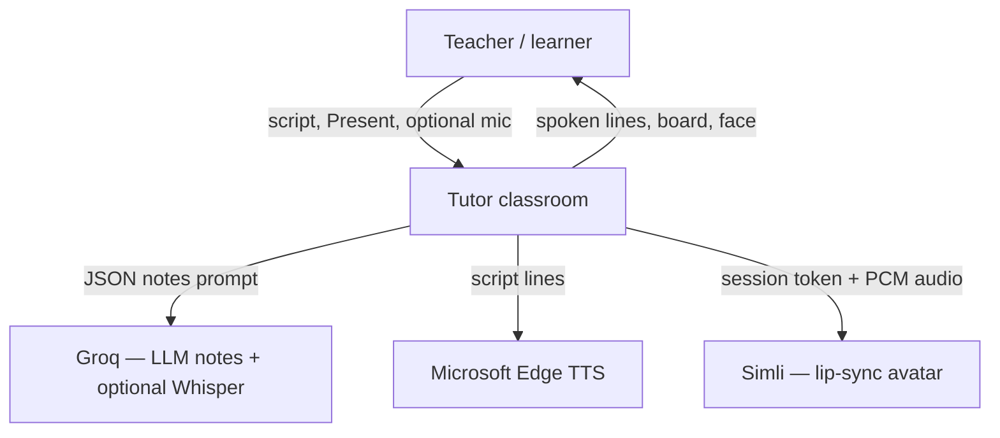

# System context

Who sits outside Tutor?

Tutor owns the classroom UI and the FastAPI backend. Groq, Edge TTS, and Simli are external providers. The LLM never owns the spoken lecture.

Rendered diagram: [architecture.svg](architecture.svg).
